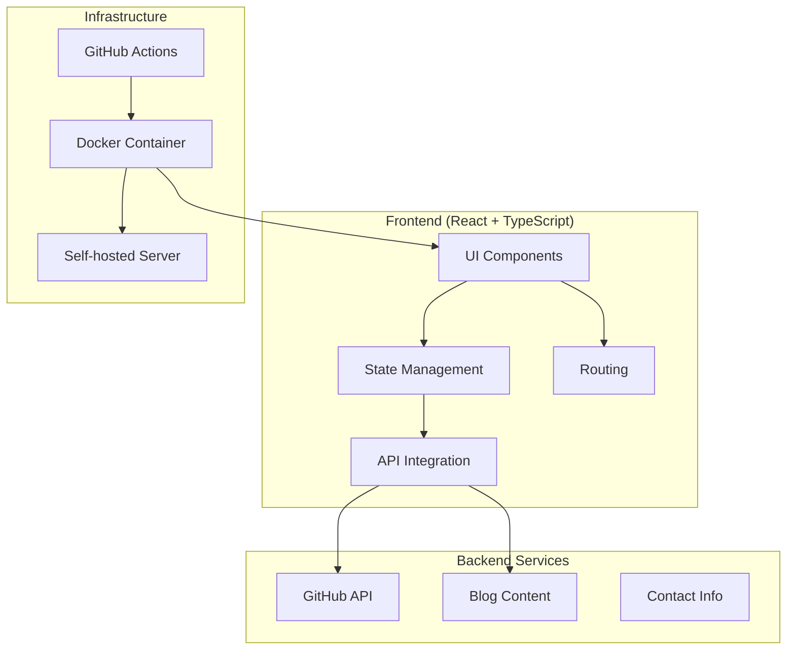

# Portfolio Website - Architecture

This document outlines the architecture and technology stack for the portfolio website.

## System Architecture

## Technology Stack

### Frontend
- **Framework**: React with TypeScript
  - Provides type safety and improved developer experience
  - Enables component-based architecture for maintainability
  - Supports modern JavaScript features

- **State Management**: React Context API or Redux Toolkit
  - Context API for simpler state requirements
  - Redux Toolkit if more complex state management is needed
  - Enables predictable state updates and debugging

- **Styling**: Styled Components or Tailwind CSS
  - Component-scoped styling to prevent conflicts
  - Theme support for consistent design language
  - Support for dynamic styling based on props/state

- **Routing**: React Router
  - Client-side routing for SPA experience
  - Support for nested routes and route parameters
  - Code-splitting capabilities for performance

- **API Integration**: Axios or Fetch API
  - Consistent interface for API requests
  - Request/response interceptors
  - Error handling and retry capabilities

- **Blog**: React-Markdown
  - Renders markdown content as React components
  - Support for syntax highlighting with Prism.js
  - Extensible with custom renderers

- **Testing**: Jest and React Testing Library
  - Unit and integration testing
  - Component testing with user-centric approach
  - Snapshot testing for UI regression prevention

### Infrastructure
- **Containerization**: Docker
  - Consistent development and production environments
  - Multi-stage builds for optimized images
  - Docker Compose for local development

- **CI/CD**: GitHub Actions
  - Automated testing on pull requests
  - Build and deployment pipelines
  - Security scanning integration

- **Deployment**: Self-hosted server
  - Nginx as reverse proxy
  - Let's Encrypt for SSL
  - Docker for containerization

- **Version Control**: Git/GitHub
  - Feature branch workflow
  - Pull request reviews
  - Integration with CI/CD

## Key Technical Considerations

1. **GitHub API Rate Limiting**
   - Implement caching to reduce API calls
   - Consider using GitHub's GraphQL API for efficiency
   - Add fallback mechanisms for rate limit errors

2. **Responsive Design**
   - Implement mobile-first approach
   - Use CSS Grid and Flexbox for layouts
   - Test on various device sizes

3. **Performance**
   - Lazy load images and components
   - Implement code splitting for route-based chunks
   - Optimize third-party dependencies

4. **Security**
   - Secure API keys and sensitive information
   - Implement proper CORS configuration
   - Regular dependency updates