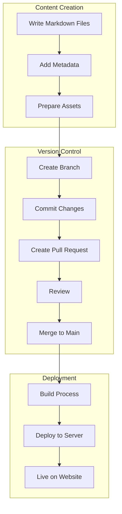

# Portfolio Website - Blog Content Management

This document details the Git-based approach for managing blog content in the portfolio website.

## Git-Based Blog Management Overview

The portfolio website will use a Git-based approach for blog content management, where markdown files are stored directly in the repository and edited via pull requests. This approach is developer-friendly and integrates well with the existing development workflow.



## Content Structure

### Directory Organization

```
content/
├── posts/               # Blog posts
│   ├── 2023-01-01-first-post.md
│   ├── 2023-02-15-second-post.md
│   └── ...
├── drafts/              # Draft posts (optional)
│   └── upcoming-post.md
└── assets/              # Blog-specific assets
    └── images/          # Images used in blog posts
        ├── 2023-01-01-first-post/
        │   ├── header.jpg
        │   └── diagram.png
        └── ...
```

### Markdown File Structure

Each blog post is a markdown file with frontmatter metadata at the top:

```markdown
---
title: "Building a React Component Library"
date: "2023-01-01"
author: "Alexandre Lebegue"
tags: ["react", "typescript", "ui"]
category: "Development"
excerpt: "A short description of the post that will appear in previews"
coverImage: "/content/assets/images/2023-01-01-first-post/header.jpg"
---

# Building a React Component Library

Content of the blog post goes here...

## Section Title

More content...

```

## Content Management Workflow

### 1. Creating New Content

1. **Create a new branch** for the blog post:
   ```bash
   git checkout -b blog/new-post-title
   ```

2. **Create a new markdown file** in the `content/posts` directory:
   ```bash
   touch content/posts/$(date +%Y-%m-%d)-post-title.md
   ```

3. **Add frontmatter metadata** at the top of the file:
   ```markdown
   ---
   title: "Post Title"
   date: "YYYY-MM-DD"
   author: "Alexandre Lebegue"
   tags: ["tag1", "tag2"]
   category: "Category"
   excerpt: "Brief description"
   coverImage: "/path/to/image"
   ---
   ```

4. **Write content** using Markdown syntax.

5. **Add images** to the appropriate directory:
   ```bash
   mkdir -p content/assets/images/$(date +%Y-%m-%d)-post-title
   ```

6. **Commit changes**:
   ```bash
   git add .
   git commit -m "Add new blog post: Post Title"
   ```

7. **Push branch and create pull request**:
   ```bash
   git push origin blog/new-post-title
   ```

### 2. Updating Existing Content

1. **Create a branch** for the update:
   ```bash
   git checkout -b blog/update-post-title
   ```

2. **Edit the markdown file** with the changes.

3. **Commit and push changes**:
   ```bash
   git add .
   git commit -m "Update blog post: Post Title"
   git push origin blog/update-post-title
   ```

4. **Create pull request** for review.

### 3. Review Process

1. **Automated checks** run on the pull request:
   - Markdown linting
   - Image optimization
   - Link validation

2. **Preview deployment** is generated to review the changes.

3. **Review and approve** the pull request.

4. **Merge** to main branch, triggering deployment.

## Implementation Details

### 1. Content Loading

The blog system will load content using a custom hook:

```typescript
// src/hooks/useBlogPosts.ts
import { useState, useEffect } from 'react';
import { BlogPost } from '../types/blog.types';

export function useBlogPosts() {
  const [posts, setPosts] = useState<BlogPost[]>([]);
  const [loading, setLoading] = useState(true);
  const [error, setError] = useState<Error | null>(null);

  useEffect(() => {
    async function loadPosts() {
      try {
        // In development, this could load from the filesystem
        // In production, this would load from the built bundle
        const postModules = import.meta.glob('/content/posts/*.md');
        const postData = await Promise.all(
          Object.entries(postModules).map(async ([path, loader]) => {
            const { frontmatter, default: component } = await loader();
            return {
              slug: path.replace('/content/posts/', '').replace('.md', ''),
              ...frontmatter,
              component,
            };
          })
        );
        
        // Sort by date, newest first
        setPosts(postData.sort((a, b) => 
          new Date(b.date).getTime() - new Date(a.date).getTime()
        ));
      } catch (err) {
        setError(err instanceof Error ? err : new Error('Failed to load posts'));
      } finally {
        setLoading(false);
      }
    }
    
    loadPosts();
  }, []);

  return { posts, loading, error };
}
```

### 2. Markdown Rendering

The blog will use react-markdown for rendering:

```typescript
// src/components/BlogPost/BlogPostContent.tsx
import React from 'react';
import ReactMarkdown from 'react-markdown';
import { Prism as SyntaxHighlighter } from 'react-syntax-highlighter';
import { vscDarkPlus } from 'react-syntax-highlighter/dist/esm/styles/prism';
import remarkGfm from 'remark-gfm';

interface BlogPostContentProps {
  content: string;
}

export const BlogPostContent: React.FC<BlogPostContentProps> = ({ content }) => {
  return (
    <ReactMarkdown
      remarkPlugins={[remarkGfm]}
      components={{
        code({ node, inline, className, children, ...props }) {
          const match = /language-(\w+)/.exec(className || '');
          return !inline && match ? (
            <SyntaxHighlighter
              style={vscDarkPlus}
              language={match[1]}
              PreTag="div"
              {...props}
            >
              {String(children).replace(/\n$/, '')}
            </SyntaxHighlighter>
          ) : (
            <code className={className} {...props}>
              {children}
            </code>
          );
        },
      }}
    >
      {content}
    </ReactMarkdown>
  );
};
```

### 3. Build Process Integration

The build process will need to:

1. **Process markdown files** during build time
2. **Optimize images** for web delivery
3. **Generate static assets** for the blog content

This can be achieved with webpack or Vite plugins:

```javascript
// vite.config.js example
import { defineConfig } from 'vite';
import react from '@vitejs/plugin-react';
import mdx from '@mdx-js/rollup';

export default defineConfig({
  plugins: [
    react(),
    mdx(),
  ],
  build: {
    rollupOptions: {
      input: {
        main: './index.html',
      },
    },
  },
});
```

## Advantages of Git-Based Approach

1. **Version Control**: Full history of all content changes
2. **Review Process**: Pull request workflow for content review
3. **Developer Friendly**: Uses familiar tools and processes
4. **Content as Code**: Content treated with same rigor as code
5. **No External Dependencies**: No need for external CMS services
6. **Offline Capability**: Can work on content without internet
7. **Backup & Recovery**: Inherits Git's robust backup capabilities

## Limitations and Considerations

1. **Technical Barrier**: Requires Git knowledge for content management
2. **No Visual Editor**: Markdown editing requires text-based workflow
3. **Image Management**: Manual process for image optimization and management
4. **Build Required**: Changes require a build step to be visible
5. **Scaling**: May become unwieldy with very large amounts of content

## Future Enhancements

1. **Markdown Editor**: Add a simple web-based editor for markdown files
2. **Image Upload**: Streamline image uploading and optimization
3. **Preview Environment**: Dedicated preview environment for draft posts
4. **Scheduled Publishing**: Mechanism for scheduling post publication
5. **Analytics Integration**: Track post performance and reader engagement