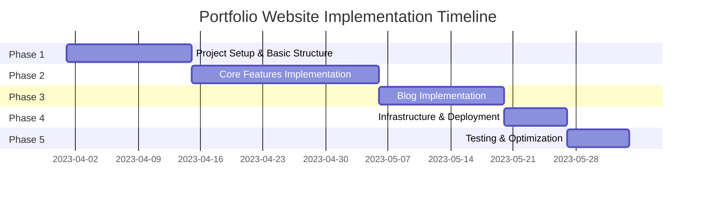

# Portfolio Website - Implementation Plan

This document outlines the phased implementation approach for the portfolio website.

## Implementation Phases



### Phase 1: Project Setup and Basic Structure (1-2 weeks)

#### 1.1 Initialize Project
- [ ] Create React app with TypeScript template
  ```bash
  npx create-react-app portfolio-website --template typescript
  ```
- [ ] Set up project structure according to structure.md
- [ ] Configure ESLint and Prettier
  ```bash
  npm install --save-dev eslint prettier eslint-config-prettier eslint-plugin-prettier
  ```
- [ ] Set up routing with React Router
  ```bash
  npm install react-router-dom @types/react-router-dom
  ```

#### 1.2 Create Basic Components
- [ ] Implement layout components
  - [ ] Header with navigation
  - [ ] Footer with social links
  - [ ] Main content container
- [ ] Create page shells for all sections
  - [ ] Home page
  - [ ] Projects page
  - [ ] CV page
  - [ ] About page
  - [ ] Blog page
  - [ ] Contact page
- [ ] Implement responsive design framework
  - [ ] Set up media queries
  - [ ] Create responsive grid system

#### 1.3 Design System
- [ ] Define color palette (tech/aerospace-inspired)
  - [ ] Primary colors
  - [ ] Secondary colors
  - [ ] Accent colors
  - [ ] Neutral colors
- [ ] Create typography system
  - [ ] Font selection (consider monospace for code elements)
  - [ ] Heading styles
  - [ ] Body text styles
  - [ ] Code block styles
- [ ] Implement code-like UI elements
  - [ ] Terminal-like components
  - [ ] Code syntax highlighting
  - [ ] Tech-inspired decorative elements
- [ ] Design responsive grid system
  - [ ] Breakpoints for different device sizes
  - [ ] Container components

### Phase 2: Core Features Implementation (2-3 weeks)

#### 2.1 GitHub Integration
- [ ] Create GitHub API service
  - [ ] Set up authentication
  - [ ] Create repository fetching functions
  - [ ] Implement caching for API responses
- [ ] Implement repository fetching and filtering
  - [ ] Fetch user repositories
  - [ ] Filter by topics/languages
  - [ ] Sort by various criteria (stars, date, etc.)
- [ ] Design project cards and project detail views
  - [ ] Project card component
  - [ ] Project detail page
  - [ ] Repository statistics visualization
- [ ] Add error handling and loading states
  - [ ] Loading skeletons
  - [ ] Error messages
  - [ ] Retry mechanisms

#### 2.2 CV Section
- [ ] Design CV layout
  - [ ] Experience timeline
  - [ ] Skills visualization
  - [ ] Education section
- [ ] Implement interactive elements for skills visualization
  - [ ] Skill categories
  - [ ] Proficiency indicators
  - [ ] Filtering/sorting options
- [ ] Create responsive timeline for experience
  - [ ] Timeline component
  - [ ] Experience cards
  - [ ] Responsive adaptations for mobile

#### 2.3 About Section
- [ ] Design engaging about section with aerospace theme
  - [ ] Personal introduction
  - [ ] Background information
  - [ ] Interests and passions
- [ ] Implement animations for visual interest
  - [ ] Scroll-triggered animations
  - [ ] Interactive elements
  - [ ] Particle effects or similar tech-inspired visuals
- [ ] Create responsive layout for different devices
  - [ ] Desktop layout
  - [ ] Tablet layout
  - [ ] Mobile layout

#### 2.4 Contact Section
- [ ] Add social media links with icons
  - [ ] GitHub
  - [ ] LinkedIn
  - [ ] Other relevant platforms
- [ ] Include email contact information
  - [ ] Email display with copy option
  - [ ] Optional contact form alternative
- [ ] Implement copy-to-clipboard functionality
  - [ ] Copy button
  - [ ] Success notification

### Phase 3: Blog Implementation (1-2 weeks)

#### 3.1 Blog Structure
- [ ] Set up blog content organization
  - [ ] Create content directory structure
  - [ ] Define metadata format for blog posts
  - [ ] Create sample blog posts
- [ ] Create markdown parsing system
  - [ ] Install and configure markdown parser
    ```bash
    npm install react-markdown remark-gfm
    ```
  - [ ] Set up syntax highlighting
    ```bash
    npm install prismjs @types/prismjs
    ```
  - [ ] Create custom renderers for markdown elements
- [ ] Implement blog listing and detail pages
  - [ ] Blog post list component
  - [ ] Blog post detail component
  - [ ] Pagination for blog list
- [ ] Add categories and tags functionality
  - [ ] Tag/category components
  - [ ] Filtering by tag/category
  - [ ] Tag cloud or similar navigation aid

#### 3.2 Blog Features
- [ ] Add syntax highlighting for code blocks
  - [ ] Configure Prism.js
  - [ ] Style code blocks to match site theme
  - [ ] Add copy code functionality
- [ ] Implement search functionality
  - [ ] Search input component
  - [ ] Search algorithm for blog content
  - [ ] Search results display
- [ ] Create related articles feature
  - [ ] Algorithm for finding related posts
  - [ ] Related posts component
  - [ ] Integration with blog post detail page
- [ ] Add social sharing options
  - [ ] Share buttons for various platforms
  - [ ] Open Graph metadata for better sharing

### Phase 4: Infrastructure and Deployment (1 week)

#### 4.1 Docker Configuration
- [ ] Create Dockerfile for application
  ```dockerfile
  # Example multi-stage build
  FROM node:16 AS builder
  WORKDIR /app
  COPY package*.json ./
  RUN npm ci
  COPY . .
  RUN npm run build

  FROM nginx:alpine
  COPY --from=builder /app/build /usr/share/nginx/html
  COPY nginx.conf /etc/nginx/conf.d/default.conf
  EXPOSE 80
  CMD ["nginx", "-g", "daemon off;"]
  ```
- [ ] Set up docker-compose for local development
  ```yaml
  # Example docker-compose.yml
  version: '3'
  services:
    portfolio:
      build: .
      ports:
        - "3000:80"
      volumes:
        - ./content:/usr/share/nginx/html/content
  ```
- [ ] Configure production-ready Docker image
  - [ ] Optimize for size and security
  - [ ] Set up environment variables
  - [ ] Configure caching headers

#### 4.2 CI/CD Pipeline
- [ ] Set up GitHub Actions workflow
  - [ ] Create workflow file (.github/workflows/ci-cd.yml)
  - [ ] Configure build steps
  - [ ] Set up deployment steps
- [ ] Configure testing in CI pipeline
  - [ ] Run unit tests
  - [ ] Run linting
  - [ ] Check for type errors
- [ ] Implement automated building and deployment
  - [ ] Build Docker image
  - [ ] Push to registry
  - [ ] Deploy to server
- [ ] Add security scanning
  - [ ] Dependency scanning
  - [ ] Docker image scanning
  - [ ] Code quality checks

#### 4.3 Deployment
- [ ] Configure self-hosted server
  - [ ] Set up server security
  - [ ] Install Docker and dependencies
  - [ ] Configure firewall
- [ ] Set up reverse proxy (Nginx)
  - [ ] Create Nginx configuration
  - [ ] Set up caching rules
  - [ ] Configure compression
- [ ] Implement SSL with Let's Encrypt
  - [ ] Install Certbot
  - [ ] Configure SSL certificates
  - [ ] Set up auto-renewal
- [ ] Configure automated backups
  - [ ] Set up backup schedule
  - [ ] Configure backup storage
  - [ ] Test backup restoration

### Phase 5: Testing and Optimization (1 week)

#### 5.1 Testing
- [ ] Implement unit tests for components
  - [ ] Set up Jest and React Testing Library
  - [ ] Write tests for key components
  - [ ] Set up test coverage reporting
- [ ] Add integration tests for key user flows
  - [ ] Navigation flow
  - [ ] GitHub project browsing
  - [ ] Blog reading experience
- [ ] Perform cross-browser testing
  - [ ] Test in Chrome, Firefox, Safari, Edge
  - [ ] Address browser-specific issues
- [ ] Conduct mobile responsiveness testing
  - [ ] Test on various device sizes
  - [ ] Test on actual mobile devices
  - [ ] Fix any responsive design issues

#### 5.2 Performance Optimization
- [ ] Optimize asset loading
  - [ ] Implement lazy loading for images
  - [ ] Optimize and compress images
  - [ ] Set up proper caching headers
- [ ] Implement code splitting
  - [ ] Route-based code splitting
  - [ ] Component-level code splitting
  - [ ] Vendor chunk optimization
- [ ] Add caching strategies
  - [ ] Browser caching
  - [ ] Service worker for offline support
  - [ ] API response caching
- [ ] Optimize for Core Web Vitals
  - [ ] Improve LCP (Largest Contentful Paint)
  - [ ] Optimize FID (First Input Delay)
  - [ ] Minimize CLS (Cumulative Layout Shift)

#### 5.3 Accessibility
- [ ] Ensure WCAG compliance
  - [ ] Proper heading structure
  - [ ] Sufficient color contrast
  - [ ] Text alternatives for non-text content
- [ ] Test with screen readers
  - [ ] NVDA or VoiceOver testing
  - [ ] Fix identified issues
- [ ] Implement keyboard navigation
  - [ ] Focus indicators
  - [ ] Logical tab order
  - [ ] Keyboard shortcuts where appropriate
- [ ] Add appropriate ARIA attributes
  - [ ] Landmark roles
  - [ ] ARIA labels
  - [ ] State indicators

## Timeline Estimate

- **Phase 1**: 1-2 weeks
- **Phase 2**: 2-3 weeks
- **Phase 3**: 1-2 weeks
- **Phase 4**: 1 week
- **Phase 5**: 1 week

Total estimated time: 6-9 weeks (depending on complexity and available time)

## Milestones and Deliverables

1. **Project Setup Complete**
   - Basic structure implemented
   - Design system established
   - Navigation working

2. **Core Features Complete**
   - GitHub integration working
   - CV section implemented
   - About section designed
   - Contact functionality working

3. **Blog System Implemented**
   - Blog posts displaying correctly
   - Markdown rendering working
   - Code syntax highlighting functional

4. **Infrastructure Ready**
   - Docker configuration complete
   - CI/CD pipeline working
   - Deployment process documented

5. **Production Launch**
   - All testing complete
   - Performance optimized
   - Accessibility verified
   - Site deployed to production