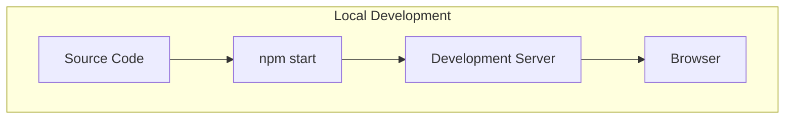
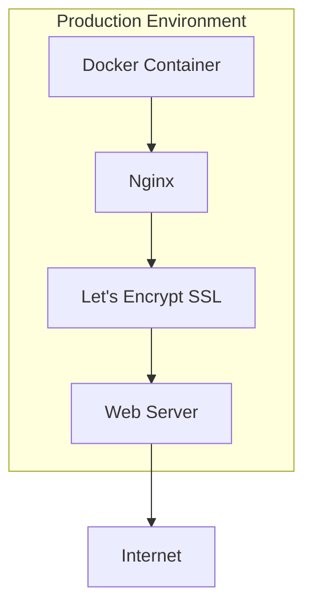
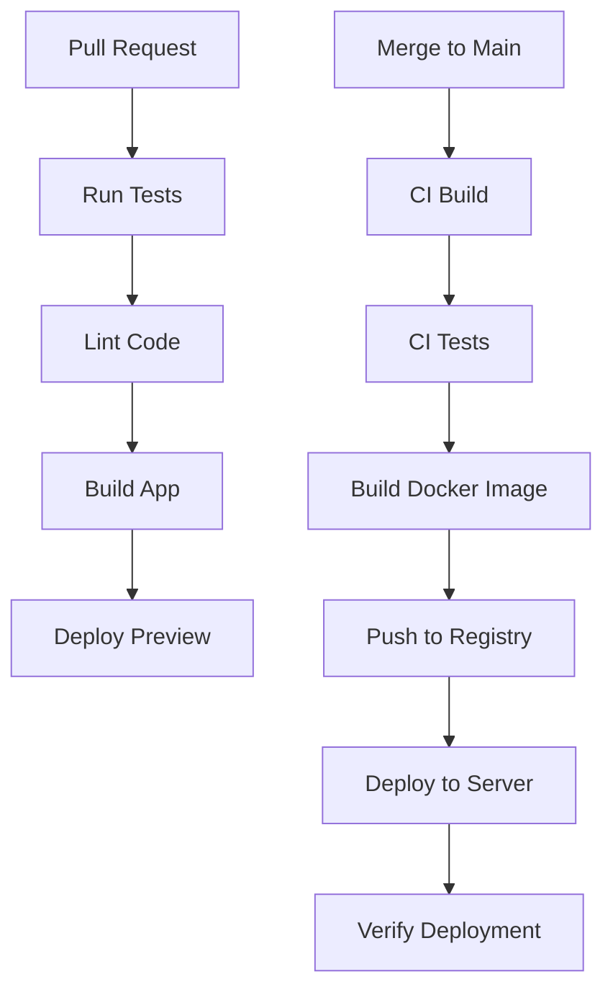

# Portfolio Website - Infrastructure and CI/CD

This document details the Docker containerization and CI/CD pipeline setup for the portfolio website.

## Docker Configuration

### Development Environment



### Production Environment



### Multi-Stage Dockerfile

```dockerfile
# Build stage
FROM node:16-alpine AS build
WORKDIR /app

# Install dependencies
COPY package*.json ./
RUN npm ci

# Copy source code
COPY . .

# Build the application
RUN npm run build

# Production stage
FROM nginx:alpine
WORKDIR /usr/share/nginx/html

# Copy built assets from build stage
COPY --from=build /app/build .

# Copy nginx configuration
COPY nginx.conf /etc/nginx/conf.d/default.conf

# Expose port 80
EXPOSE 80

# Start nginx
CMD ["nginx", "-g", "daemon off;"]
```

### Docker Compose Configuration

#### Development

```yaml
version: '3'

services:
  portfolio-dev:
    build:
      context: .
      dockerfile: Dockerfile.dev
    ports:
      - "3000:3000"
    volumes:
      - ./src:/app/src
      - ./public:/app/public
      - ./content:/app/content
    environment:
      - NODE_ENV=development
      - REACT_APP_GITHUB_TOKEN=${GITHUB_TOKEN}
```

#### Production

```yaml
version: '3'

services:
  portfolio:
    build:
      context: .
      dockerfile: Dockerfile
    restart: always
    ports:
      - "80:80"
      - "443:443"
    volumes:
      - ./content:/usr/share/nginx/html/content
      - ./nginx/logs:/var/log/nginx
      - ./certbot/conf:/etc/letsencrypt
      - ./certbot/www:/var/www/certbot
    environment:
      - NODE_ENV=production
      - REACT_APP_GITHUB_TOKEN=${GITHUB_TOKEN}
  
  certbot:
    image: certbot/certbot
    restart: unless-stopped
    volumes:
      - ./certbot/conf:/etc/letsencrypt
      - ./certbot/www:/var/www/certbot
    entrypoint: "/bin/sh -c 'trap exit TERM; while :; do certbot renew; sleep 12h & wait $${!}; done;'"
```

### Nginx Configuration

```nginx
server {
    listen 80;
    server_name yourdomain.com www.yourdomain.com;
    
    location /.well-known/acme-challenge/ {
        root /var/www/certbot;
    }
    
    location / {
        return 301 https://$host$request_uri;
    }
}

server {
    listen 443 ssl;
    server_name yourdomain.com www.yourdomain.com;
    
    ssl_certificate /etc/letsencrypt/live/yourdomain.com/fullchain.pem;
    ssl_certificate_key /etc/letsencrypt/live/yourdomain.com/privkey.pem;
    
    # SSL configuration
    ssl_protocols TLSv1.2 TLSv1.3;
    ssl_prefer_server_ciphers on;
    ssl_ciphers ECDHE-ECDSA-AES128-GCM-SHA256:ECDHE-RSA-AES128-GCM-SHA256:ECDHE-ECDSA-AES256-GCM-SHA384:ECDHE-RSA-AES256-GCM-SHA384:ECDHE-ECDSA-CHACHA20-POLY1305:ECDHE-RSA-CHACHA20-POLY1305:DHE-RSA-AES128-GCM-SHA256:DHE-RSA-AES256-GCM-SHA384;
    
    # HSTS
    add_header Strict-Transport-Security "max-age=31536000; includeSubDomains" always;
    
    # Other security headers
    add_header X-Content-Type-Options nosniff;
    add_header X-Frame-Options DENY;
    add_header X-XSS-Protection "1; mode=block";
    
    # Root directory
    root /usr/share/nginx/html;
    index index.html;
    
    # Gzip compression
    gzip on;
    gzip_types text/plain text/css application/json application/javascript text/xml application/xml application/xml+rss text/javascript;
    
    # Cache static assets
    location ~* \.(jpg|jpeg|png|gif|ico|css|js)$ {
        expires 1y;
        add_header Cache-Control "public, max-age=31536000, immutable";
    }
    
    # Handle SPA routing
    location / {
        try_files $uri $uri/ /index.html;
    }
    
    # Blog content
    location /content/ {
        alias /usr/share/nginx/html/content/;
        try_files $uri $uri/ =404;
    }
}
```

## CI/CD Pipeline

### GitHub Actions Workflow



### GitHub Actions Workflow File

```yaml
name: Portfolio CI/CD

on:
  push:
    branches: [ main ]
  pull_request:
    branches: [ main ]

jobs:
  test:
    runs-on: ubuntu-latest
    steps:
      - uses: actions/checkout@v2
      
      - name: Set up Node.js
        uses: actions/setup-node@v2
        with:
          node-version: '16'
          cache: 'npm'
          
      - name: Install dependencies
        run: npm ci
        
      - name: Run linting
        run: npm run lint
        
      - name: Run tests
        run: npm test
        
  build:
    needs: test
    runs-on: ubuntu-latest
    if: github.event_name == 'push' && github.ref == 'refs/heads/main'
    steps:
      - uses: actions/checkout@v2
      
      - name: Set up Node.js
        uses: actions/setup-node@v2
        with:
          node-version: '16'
          cache: 'npm'
          
      - name: Install dependencies
        run: npm ci
        
      - name: Build application
        run: npm run build
        
      - name: Set up Docker Buildx
        uses: docker/setup-buildx-action@v1
        
      - name: Login to DockerHub
        uses: docker/login-action@v1
        with:
          username: ${{ secrets.DOCKERHUB_USERNAME }}
          password: ${{ secrets.DOCKERHUB_TOKEN }}
          
      - name: Build and push Docker image
        uses: docker/build-push-action@v2
        with:
          context: .
          push: true
          tags: yourusername/portfolio:latest
          
  deploy:
    needs: build
    runs-on: ubuntu-latest
    if: github.event_name == 'push' && github.ref == 'refs/heads/main'
    steps:
      - name: Deploy to server
        uses: appleboy/ssh-action@master
        with:
          host: ${{ secrets.SERVER_HOST }}
          username: ${{ secrets.SERVER_USERNAME }}
          key: ${{ secrets.SERVER_SSH_KEY }}
          script: |
            cd /path/to/portfolio
            docker-compose pull
            docker-compose down
            docker-compose up -d
            
      - name: Verify deployment
        run: |
          sleep 30
          curl -s --head --request GET https://yourdomain.com | grep "200 OK"
```

## Server Setup

### Initial Server Configuration

1. **Update system packages**:
   ```bash
   sudo apt update && sudo apt upgrade -y
   ```

2. **Install Docker and Docker Compose**:
   ```bash
   # Install Docker
   curl -fsSL https://get.docker.com -o get-docker.sh
   sudo sh get-docker.sh
   
   # Add user to docker group
   sudo usermod -aG docker $USER
   
   # Install Docker Compose
   sudo curl -L "https://github.com/docker/compose/releases/download/v2.5.0/docker-compose-$(uname -s)-$(uname -m)" -o /usr/local/bin/docker-compose
   sudo chmod +x /usr/local/bin/docker-compose
   ```

3. **Configure firewall**:
   ```bash
   sudo apt install ufw
   sudo ufw allow ssh
   sudo ufw allow http
   sudo ufw allow https
   sudo ufw enable
   ```

4. **Set up project directory**:
   ```bash
   mkdir -p ~/portfolio
   cd ~/portfolio
   mkdir -p nginx/logs certbot/conf certbot/www content
   ```

5. **Create deployment script**:
   ```bash
   cat > deploy.sh << 'EOF'
   #!/bin/bash
   
   # Pull latest changes
   git pull
   
   # Build and restart containers
   docker-compose down
   docker-compose up -d
   
   # Check container status
   docker-compose ps
   EOF
   
   chmod +x deploy.sh
   ```

### SSL Certificate Setup

1. **Initialize SSL certificates**:
   ```bash
   # Stop any running containers
   docker-compose down
   
   # Start nginx container
   docker-compose up -d nginx
   
   # Get SSL certificate
   docker-compose run --rm certbot certonly --webroot --webroot-path=/var/www/certbot --email your@email.com --agree-tos --no-eff-email -d yourdomain.com -d www.yourdomain.com
   
   # Restart containers
   docker-compose down
   docker-compose up -d
   ```

2. **Set up auto-renewal**:
   ```bash
   # Test renewal
   docker-compose run --rm certbot renew --dry-run
   
   # Add to crontab
   echo "0 3 * * * cd /path/to/portfolio && docker-compose run --rm certbot renew >> /var/log/certbot-renew.log 2>&1" | sudo tee -a /etc/crontab
   ```

## Backup Strategy

### Automated Backups

1. **Create backup script**:
   ```bash
   cat > backup.sh << 'EOF'
   #!/bin/bash
   
   # Set variables
   BACKUP_DIR="/path/to/backups"
   TIMESTAMP=$(date +"%Y%m%d_%H%M%S")
   
   # Create backup directory if it doesn't exist
   mkdir -p $BACKUP_DIR
   
   # Backup content directory
   tar -czf $BACKUP_DIR/content_$TIMESTAMP.tar.gz -C /path/to/portfolio content
   
   # Backup SSL certificates
   tar -czf $BACKUP_DIR/certbot_$TIMESTAMP.tar.gz -C /path/to/portfolio certbot
   
   # Backup nginx configuration
   tar -czf $BACKUP_DIR/nginx_$TIMESTAMP.tar.gz -C /path/to/portfolio nginx
   
   # Backup docker-compose.yml
   cp /path/to/portfolio/docker-compose.yml $BACKUP_DIR/docker-compose_$TIMESTAMP.yml
   
   # Remove backups older than 30 days
   find $BACKUP_DIR -name "*.tar.gz" -type f -mtime +30 -delete
   find $BACKUP_DIR -name "*.yml" -type f -mtime +30 -delete
   
   echo "Backup completed: $(date)"
   EOF
   
   chmod +x backup.sh
   ```

2. **Schedule regular backups**:
   ```bash
   echo "0 2 * * * /path/to/portfolio/backup.sh >> /var/log/portfolio-backup.log 2>&1" | sudo tee -a /etc/crontab
   ```

### Offsite Backups

1. **Set up rclone for cloud storage**:
   ```bash
   # Install rclone
   curl https://rclone.org/install.sh | sudo bash
   
   # Configure rclone
   rclone config
   
   # Add to backup script
   echo "# Sync to cloud storage" >> backup.sh
   echo "rclone sync $BACKUP_DIR remote:portfolio-backups" >> backup.sh
   ```

## Monitoring and Logging

### Basic Monitoring

1. **Set up Docker container monitoring**:
   ```bash
   # Install ctop
   sudo wget https://github.com/bcicen/ctop/releases/download/v0.7.7/ctop-0.7.7-linux-amd64 -O /usr/local/bin/ctop
   sudo chmod +x /usr/local/bin/ctop
   ```

2. **Set up log rotation**:
   ```bash
   sudo apt install logrotate
   
   cat > /etc/logrotate.d/portfolio << 'EOF'
   /path/to/portfolio/nginx/logs/*.log {
       daily
       missingok
       rotate 14
       compress
       delaycompress
       notifempty
       create 0640 www-data adm
       sharedscripts
       postrotate
           [ -s /var/run/nginx.pid ] && kill -USR1 `cat /var/run/nginx.pid`
       endscript
   }
   EOF
   ```

### Advanced Monitoring (Optional)

1. **Set up Prometheus and Grafana**:
   ```yaml
   # Add to docker-compose.yml
   prometheus:
     image: prom/prometheus
     volumes:
       - ./prometheus:/etc/prometheus
       - prometheus_data:/prometheus
     command:
       - '--config.file=/etc/prometheus/prometheus.yml'
     ports:
       - "9090:9090"
     restart: always
   
   grafana:
     image: grafana/grafana
     volumes:
       - grafana_data:/var/lib/grafana
     ports:
       - "3000:3000"
     restart: always
   
   volumes:
     prometheus_data:
     grafana_data:
   ```

## Security Considerations

1. **Regular updates**:
   ```bash
   # Add to crontab
   echo "0 1 * * * apt update && apt upgrade -y >> /var/log/system-update.log 2>&1" | sudo tee -a /etc/crontab
   ```

2. **Fail2ban installation**:
   ```bash
   sudo apt install fail2ban
   sudo systemctl enable fail2ban
   sudo systemctl start fail2ban
   ```

3. **Docker security best practices**:
   - Use official images
   - Keep images updated
   - Scan images for vulnerabilities
   - Use non-root users in containers
   - Limit container resources

4. **Environment variables**:
   - Use .env file for sensitive information
   - Never commit .env files to version control
   - Use GitHub secrets for CI/CD variables