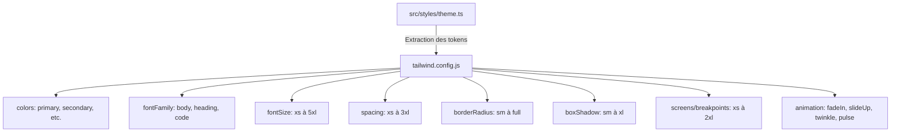
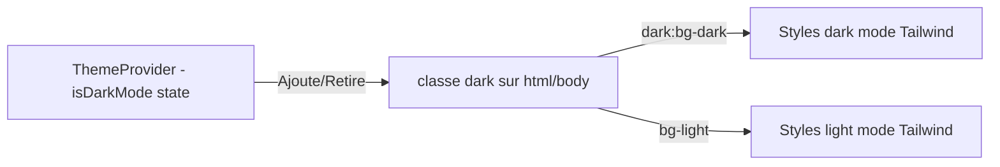
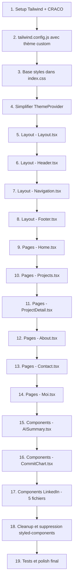

# Plan de Migration : styled-components → Tailwind CSS

## 1. Vue d'ensemble

Migration complète du portfolio React de **styled-components** vers **Tailwind CSS** pour améliorer la fluidité, l'esthétique et les performances du site.

### État actuel
- **Framework** : React 19 + TypeScript + Create React App (react-scripts 5.0.1)
- **Styling** : styled-components v6.1.16 (~20 fichiers, ~4000+ lignes de styles)
- **Theme** : Système de design tokens custom (couleurs, fonts, spacing, breakpoints)
- **Dark/Light mode** : Via `ThemeProvider` context + styled-components `ThemeProvider`

### Objectif
- Remplacer styled-components par Tailwind CSS v3.4+
- Améliorer la fluidité (transitions, animations, responsive)
- Rendre le site plus esthétique (glassmorphism, gradients, micro-interactions)
- Conserver le dark/light mode fonctionnel

---

## 2. Architecture Technique

### 2.1 Setup Tailwind avec CRA

CRA ne supporte pas nativement la configuration PostCSS. Nous utiliserons **CRACO** (Create React App Configuration Override) pour injecter Tailwind sans éjecter.

```
Dépendances à installer :
- @craco/craco
- tailwindcss
- postcss
- autoprefixer
```

Les scripts dans `package.json` changeront de `react-scripts` à `craco`.

### 2.2 Mapping du thème existant → tailwind.config.js



#### Correspondance des couleurs

| Theme actuel | Tailwind custom |
|---|---|
| `colors.primary` (#0B3D91) | `primary` |
| `colors.secondary` (rgb 96,0,199) | `secondary` |
| `colors.tertiary` (#4D7C8A) | `tertiary` |
| `colors.text.accent` (#00D8FF) | `accent` |
| `colors.background.dark` (#121212) | `bg-dark` |
| `colors.background.light` (#F8F9FA) | `bg-light` |
| `colors.status.*` | `success`, `warning`, `error`, `info` |

### 2.3 Stratégie Dark Mode

Tailwind supportera le dark mode avec la stratégie `class` :



Le `ThemeProvider` sera simplifié :
- Plus besoin de `StyledThemeProvider` ni de `GlobalStyles`
- Il ajoutera/retirera la classe `dark` sur `<html>`
- Conservera le hook `useTheme()` pour le toggle

### 2.4 Gestion des styles dynamiques

Certains composants ont des props dynamiques (ex: `Star` avec positions aléatoires, `FilterButton` avec état `$active`). Ces cas seront gérés par :

1. **Props conditionnelles** → Template literals Tailwind + `cn()` helper (clsx/tailwind-merge)
2. **Valeurs calculées dynamiquement** (positions aléatoires des étoiles) → `style={{ }}` inline
3. **Animations keyframes custom** → Définies dans `tailwind.config.js` sous `extend.keyframes` et `extend.animation`

---

## 3. Fichiers à migrer

### 3.1 Infrastructure (4 fichiers)

| Fichier | Action |
|---|---|
| `src/styles/theme.ts` | Remplacé par `tailwind.config.js` |
| `src/styles/globalStyles.ts` | Remplacé par `src/index.css` avec `@tailwind` directives |
| `src/context/ThemeProvider.tsx` | Simplifié - toggle classe `dark` sur html |
| `src/App.tsx` | Retirer import ThemeProvider styled, simplifier |

### 3.2 Layout (4 fichiers)

| Fichier | Styled Components | Complexité |
|---|---|---|
| `Layout.tsx` | 2 composants | Faible |
| `Header.tsx` | 5 composants | Moyenne |
| `Navigation.tsx` | ~12 composants + mobile nav | Élevée |
| `Footer.tsx` | ~8 composants | Moyenne |

### 3.3 Pages (6 fichiers)

| Fichier | Styled Components | Lignes | Complexité |
|---|---|---|---|
| `Home.tsx` | ~15 + Star animation | 407 | Élevée |
| `Projects.tsx` | ~12 + filtres dynamiques | 386 | Élevée |
| `ProjectDetail.tsx` | ~15 | 406 | Élevée |
| `About.tsx` | ~12 | 284 | Moyenne |
| `Contact.tsx` | ~8 | 176 | Faible |
| `Moi.tsx` | ~20+ | 915 | Très élevée |

### 3.4 Composants (7 fichiers)

| Fichier | Styled Components | Complexité |
|---|---|---|
| `AISummary.tsx` | ~10 + animations | Élevée |
| `CommitChart.tsx` | 1 container | Faible |
| `Education.tsx` | ~10 | Moyenne |
| `FileUpload.tsx` | ~15+ drag-drop | Élevée |
| `ProfileHero.tsx` | ~10 | Moyenne |
| `Skills.tsx` | ~10 | Moyenne |
| `Timeline.tsx` | ~12 | Moyenne |

---

## 4. Améliorations esthétiques prévues

En plus de la migration, voici les améliorations visuelles à intégrer :

### 4.1 Transitions et animations
- Transitions fluides `transition-all duration-300 ease-in-out` sur les cartes
- Hover effects avec `hover:scale-[1.02]` et `hover:shadow-xl`
- Animation d'entrée `animate-fadeIn` sur les sections au scroll
- Animation de gradient subtile sur les titres principaux

### 4.2 Glassmorphism et effets visuels
- Header avec `backdrop-blur-md bg-opacity-80`
- Cartes avec `backdrop-blur-sm` et bordures subtiles
- Gradients sur les badges et boutons CTA

### 4.3 Responsive amélioré
- Utilisation systématique des breakpoints Tailwind `sm:`, `md:`, `lg:`, `xl:`
- Grilles responsives avec `grid-cols-1 md:grid-cols-2 lg:grid-cols-3`
- Typography responsive avec `text-2xl md:text-3xl lg:text-4xl`

### 4.4 Dark/Light mode polish
- Transitions douces entre dark et light mode via `transition-colors duration-300`
- Couleurs mieux contrastées pour chaque mode
- Ombres adaptées au mode (subtiles en dark, prononcées en light)

---

## 5. Ordre d'exécution



---

## 6. Utilitaire helper - cn function

Un fichier utilitaire sera créé pour gérer la composition conditionnelle de classes :

```typescript
// src/utils/cn.ts
import { clsx, type ClassValue } from 'clsx';
import { twMerge } from 'tailwind-merge';

export function cn(...inputs: ClassValue[]) {
  return twMerge(clsx(inputs));
}
```

Dépendances additionnelles : `clsx`, `tailwind-merge`

---

## 7. Dépendances finales

### À ajouter
- `@craco/craco`
- `tailwindcss` (^3.4)
- `postcss`
- `autoprefixer`
- `clsx`
- `tailwind-merge`

### À supprimer
- `styled-components`
- `@types/styled-components`

---

## 8. Risques et mitigations

| Risque | Mitigation |
|---|---|
| CRACO incompatible avec react-scripts 5 | Vérifier compatibilité, alternative : craco fork ou postcss-loader custom |
| Perte de styles dynamiques complexes | Utiliser inline styles + CSS variables pour valeurs calculées |
| Star animation avec props aléatoires | Conserver en inline style pour les valeurs dynamiques |
| Régression visuelle dark/light mode | Tester chaque composant dans les 2 modes après migration |
| Taille du bundle CSS Tailwind | PurgeCSS intégré dans Tailwind v3+ - pas de souci |
